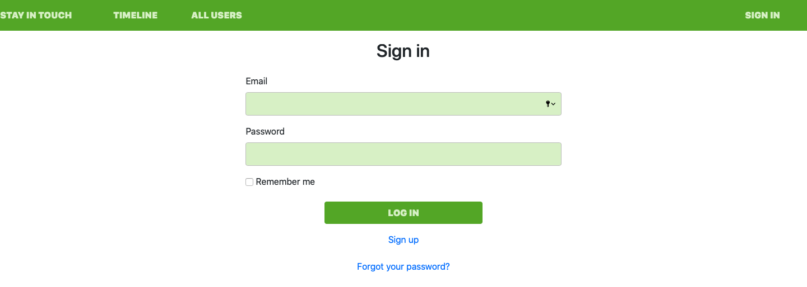
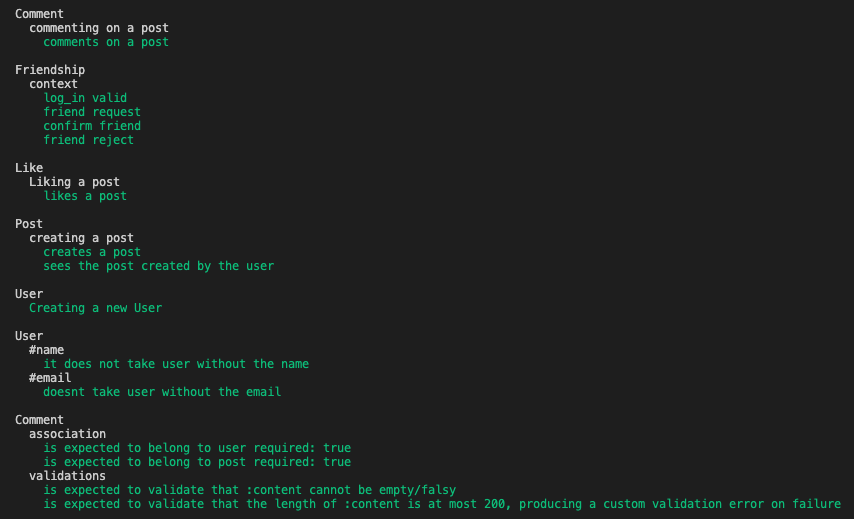
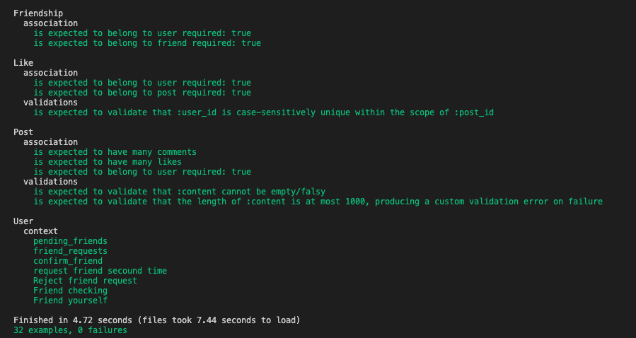

# Scaffold for social media app with Ruby on Rails

We forked this initial scaffold repository [click here](https://github.com/microverseinc/ror-social-scaffold) and implemented the friendship model and functionality.

> This repo includes the code for a social media app deployed on Heroku. On this app, people can create users and posts. Every user has the opportunity to interact with other users as writing comments, giving likes and sending friend requests.



## Built With

- Ruby v2.6.5
- Ruby on Rails v5.2.4
- Bootstrap

## Live Demo

- Heroku App.

You can click on this [link](https://social-media-bru-emi.herokuapp.com/users/sign_in)


## Getting Started

To get a local copy up and running follow these simple example steps.

1.- Click on the install or download button under the repository name and copy the URL by clicking on the icon.

2.- Open your terminal. To open the terminal, press Ctrl+Alt+T(Ubuntu) or if you are using Mac Command + Space and type in 'Terminal'.

3.- Navigate to the location in your computer where you want the repo to be cloned. Remeber that you have to type 'cd' first.

4.- Type git clone and paste the url you copied on step one.

### Prerequisites

Ruby: 2.6.3
Rails: 5.2.3
Postgres: >=9.5

### Setup

> Remember that you need PostgresQL installed in your computer, if you don't have it, you can follow this [tutorial](https://phoenixnap.com/kb/how-to-install-postgresql-on-ubuntu) to install it.

Instal gems with:

```
bundle install
```

Setup database with:

```
   rails db:create
   rails db:migrate
```

### Usage

Start server with:

```
    rails server
```

Open `http://localhost:3000/` in your browser.

### Run tests

```
    rspec --format documentation
```

> We have added tests for the user model. Checking out the proper functionality of the friendship requests, acceptance and denial.




### Deployment

To deploy this repo, we used Heroku web app. We created a new app named 'social-media-bru-emi' to deploy the content, and migrated the PostgresQL database using 'heroku run rails db:migrate' command.

> You can access to the deployed app following this [link](https://social-media-bru-emi.herokuapp.com/users/sign_in)

## Authors

👤 **Emilio Contreras**

- Github: [@emiliocm9](https://github.com/emiliocm9)
- Twitter: [@emiliocm31](https://twitter.com/emiliocm31)
- Email: [email](emilio.contreras97@gmail.com)

👤 **Bruna Gobi**

- Github: [@brugobi](https://github.com/brugobi)
- Twitter: [@BrunaGobi2](https://twitter.com/BrunaGobi2)
- Linkedin: [bruna-gobi](https://www.linkedin.com/in/bruna-gobi/)

## 🤝 Contributing

Contributions, issues and feature requests are welcome!

Feel free to check the [issues page](issues/).

## Show your support

Give a ⭐️ if you like this project!

## Acknowledgments

- Project inspired by Microverse Program.

